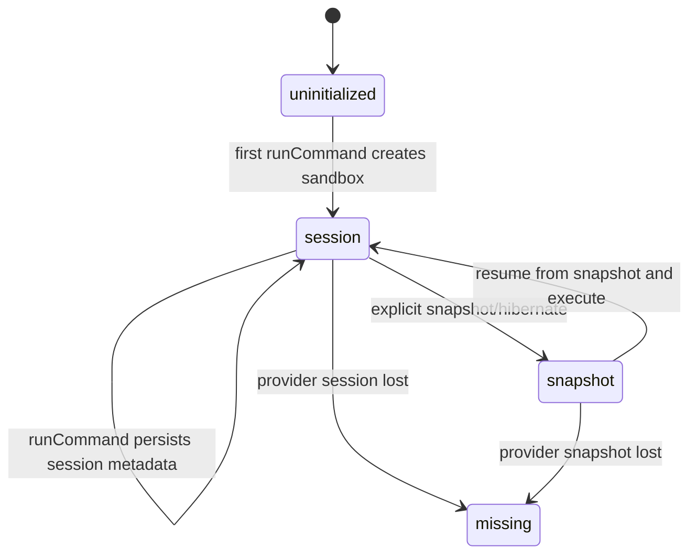

# Sandkit Sandbox State Machine

This document defines the lifecycle model for Sandkit-managed sandboxes.

The goal is to keep the public API simple:

```ts
const workspace = await sandkit.getWorkspace(id);
const result = await workspace.sandbox.runCommand("cat", ["./hello.txt"]);
```

At the same time, Sandkit must correctly manage provider-specific lifecycle rules such as Vercel Sandbox snapshot behavior.

## Core Rules

- Public callers interact with `workspace.sandbox`, not `createOrResumeSandbox()`.
- `workspace.sandbox` is a lazy handle, not a concrete sandbox instance.
- `sandbox.runCommand(...)` is one unit of work.
- Persistence is Sandkit's responsibility, not the caller's responsibility.
- A provider snapshot is not a passive save operation.
  For Vercel Sandbox, creating a snapshot stops the sandbox.

## Terminology

- `workspace`: durable record owned by Sandkit.
- `sandbox handle`: lazy public object exposed as `workspace.sandbox`.
- `resolved sandbox`: provider-backed concrete sandbox instance.
- `session state`: enough metadata to reconnect to a live or resumable sandbox session.
- `snapshot state`: enough metadata to restore from a provider snapshot.

## Public Model

The public model intentionally hides lifecycle mechanics.

- `workspace.sandbox.runCommand(...)`
  Sandkit resolves a concrete sandbox, executes the command, and persists updated state.
- Callers should not decide when to snapshot.
- Callers should not need to know whether the provider resumed from a live session or a snapshot.

## State Set

Sandkit tracks sandbox lifecycle at the workspace level.

### 1. `uninitialized`

No sandbox has been created for the workspace yet.

Properties:

- No persisted sandbox metadata exists.
- First command must create a new provider sandbox.

### 2. `session`

The workspace has enough provider metadata to reconnect to an existing sandbox session.

Properties:

- Sandkit stores session-oriented restore information such as `sandboxId`.
- The provider sandbox may still be running, or may be resumable through provider APIs.
- This is the normal state after `runCommand(...)`.

### 3. `snapshot`

The workspace has enough provider metadata to restore from a provider snapshot.

Properties:

- Sandkit stores snapshot-oriented restore information such as `snapshotId`.
- The previous concrete sandbox instance must be considered closed.
- Resume creates a new concrete runtime from the snapshot.

### 4. `missing`

Sandkit expected provider state, but the provider no longer has it.

Examples:

- stored `sandboxId` no longer exists
- stored `snapshotId` no longer exists

Properties:

- Sandkit must surface a concrete error or fall back according to policy.
- This is a recovery state, not a steady-state target.

## Transitions



## Unit Of Work

`runCommand(...)` is one unit of work.

Sandkit performs the following steps:

1. Resolve the latest workspace record.
2. Resolve a concrete sandbox from persisted state.
3. Execute the command.
4. Persist the next workspace sandbox state.
5. Return the command result or rethrow the error.

Important:

- Step 4 runs on both success and failure paths.
- Persistence policy belongs to Sandkit.
- The caller must not be responsible for durability.

## Persistence Policy

The intended default policy is:

- `runCommand(...)` automatically persists durable state.
- Callers do not manually decide whether to persist after the command.
- For providers where durable persistence is implemented through snapshots, Sandkit should create a snapshot at the end of the unit of work.

Reason:

- Persistence responsibility belongs to Sandkit, not the caller.
- If callers have to explicitly persist, unexpected errors can discard meaningful sandbox state changes.
- A unit of work is only complete when Sandkit has both executed the command and secured the resulting state.

## Snapshot Semantics

Snapshot is a lifecycle event, not a passive save.

Rules:

- If Sandkit creates a snapshot, it must treat the current concrete sandbox as no longer usable.
- After snapshot creation, persisted state should move to `snapshot`.
- Future operations must resolve a new concrete sandbox from snapshot restore data.

Implication:

- If Sandkit uses snapshots as the durability mechanism for `runCommand()`, then `runCommand()` must be modeled as:
  execute -> snapshot -> stop current sandbox -> persist snapshot restore state
- In that model, ending the concrete sandbox session is part of the normal command commit behavior.

## Provider Expectations

Providers must fit the Sandkit contract, but provider semantics are not identical.

### Vercel Sandbox

- `Sandbox.create(...)` creates a concrete runtime.
- `Sandbox.get(...)` reconnects to a concrete runtime by sandbox id.
- `snapshot()` creates a restore point and stops the sandbox.

Therefore:

- automatic durability after `runCommand(...)` may require snapshot creation
- if snapshot is the durability mechanism, Sandkit must model the resulting stop as part of the normal state transition
- the next command should resume from persisted restore metadata rather than assuming the prior concrete sandbox is still live

## Invariants

These must remain true across implementations.

- Public callers see a stable sandbox interface, not provider lifecycle APIs.
- `workspace.sandbox` may be lazy, but `runCommand(...)` must behave deterministically.
- Sandkit owns persistence decisions.
- Provider stop/snapshot semantics must not be ignored or silently contradicted.
- A persisted workspace record must always describe one restore strategy clearly:
  either session-oriented restore or snapshot-oriented restore.

## Non-Goals

These are intentionally not assumed.

- SQL-style rollback semantics
- provider-independent atomic filesystem rollback

## Future Extension

A future `runTx(...)` API can extend this model.

Expected shape:

- `runCommand(...)` remains a single-command unit of work
- `runTx(...)` would group multiple commands into one persistence boundary

Even then, `runTx(...)` should be modeled as a checkpointed unit of work, not as a rollback-capable SQL transaction.
